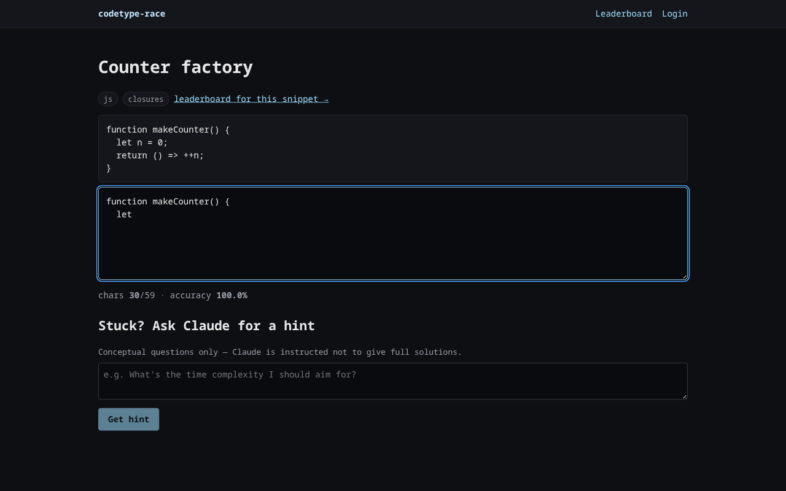
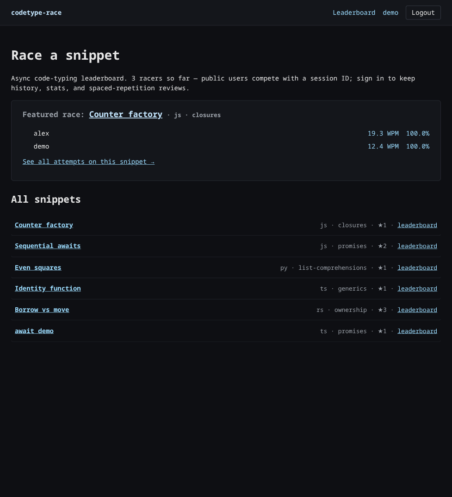
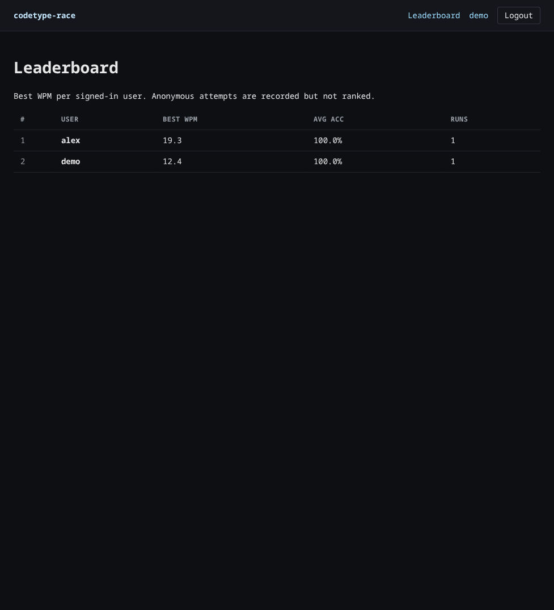
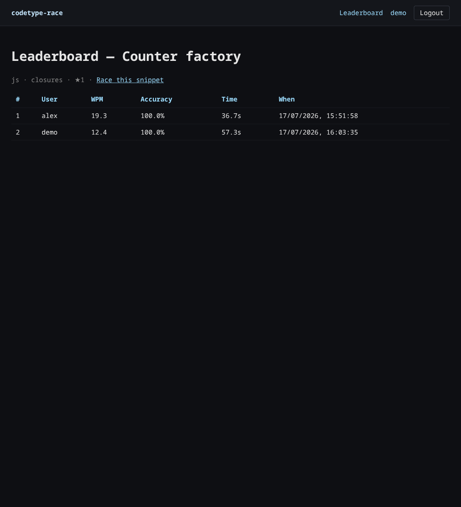
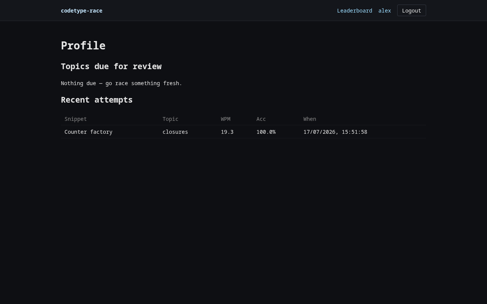
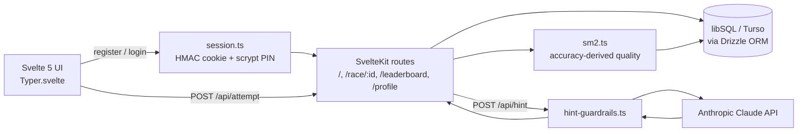
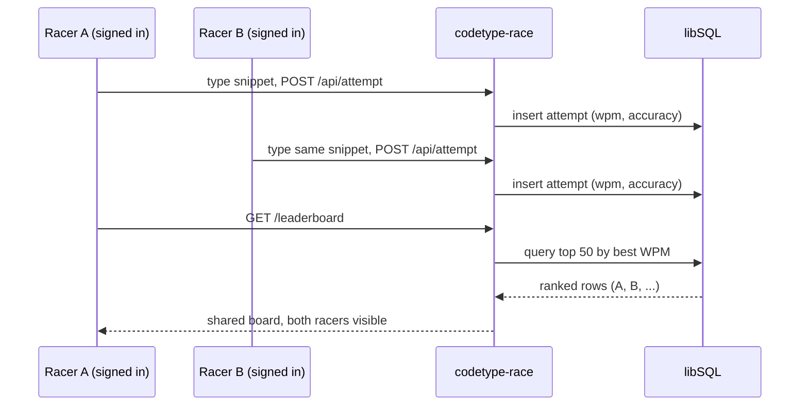

# codetype-race

[](https://github.com/jgyy/codetype-race/actions/workflows/ci.yml)

**An async code-typing leaderboard for teams.** Race real snippets against your teammates, keep your stats when signed in, and let Claude coach you toward your weak topics — never just hand you the answer.

<p align="center">
  
</p>

### B1 Builders Programme — Project #2 of 2: _team / organisational use_

> _"A project that operates on shared resources and **supports multiple users** rather than a single individual."_

Companion: [`codetype-solo`](../codetype-solo) — the individual-use submission (a private practice trainer). This one is the opposite by design: public snippets, a shared leaderboard, many accounts racing the same content.

| Axis | This (`codetype-race`) | Companion (`codetype-solo`) |
|---|---|---|
| Scale | Team / organisational use | Individual use |
| Identity | Handle + scrypt PIN | PIN-only HMAC cookie |
| Shared resource | Snippets + leaderboards | None |

---

## Overview

### Problem
- **Who:** students and early-career developers who read code fluently but type it slowly enough that interviews and pair-programming suffer.
- **Issue:** no shared, async surface where a team can practise typing *code* together, compare progress, and get AI coaching on personal weak spots.

### Outcome
- A public leaderboard where anonymous and signed-in racers compete on the same snippets — two people, one snippet, comparative stats.
- A per-user SM-2 spaced-repetition queue for weak topics: concrete progression beyond a raw WPM number.
- Claude-powered hints, strictly guardrailed — conceptual nudges only, never the full solution.
- Stateless HMAC session cookies with real tests for integrity, constant-time PIN compare, and expiry.

---

## Demo

1. Land on `/` — see the featured race, the current leaderboard preview, and how many racers have shown up so far, no sign-in required.
2. Pick a snippet, type it — chars and accuracy update live; WPM appears in the result panel on completion.
3. Sign in to have your attempt ranked. A second teammate does the same snippet from their own account.
4. Both show up on `/leaderboard` and the per-snippet board, ordered by best WPM.

| | |
|---|---|
|  |  |
|  |  |

---

## Technology Stack

### Frontend components
- SvelteKit + TypeScript, Svelte 5 runes for the typing surface.
- CodeMirror 6 (wired, syntax-highlighted typing surface in progress).
- No CSS framework — a dark, monospace design-token system (`+layout.svelte`).

### Backend components
- SvelteKit server routes on Vercel Functions.
- Drizzle ORM over libSQL (local SQLite in dev, Turso in prod — [ADR 0001](docs/adr/0001-libsql-over-postgres.md)).
- HMAC-signed session cookie, scrypt-hashed PINs, constant-time compare.
- Anthropic Claude for `/api/hint`, gated by `hint-guardrails.ts`.
- SM-2 spaced repetition ([ADR 0002](docs/adr/0002-spaced-repetition-algorithm.md)) driving `topic_mastery`.



The shared leaderboard is the whole point — two racers, one snippet, one ranked board:



### Claude prompt guardrails
`src/lib/server/hint-guardrails.ts` validates *before* tokens are spent and sanitises *after*: pre-call regex rejects "full solution" / prompt-injection phrasing and oversize questions; the system prompt is capped to short conceptual hints; the response is stripped of long fenced code and truncated; an in-memory rate limit caps hints per session.

---

## Development Approach with AI

| Tool | Model | Purpose |
|---|---|---|
| Claude Code | Opus 4.7 | Codebase scaffolding, schema, guardrail authoring |
| Anthropic API | `claude-sonnet-4-6` | Runtime `/api/hint` and per-attempt summary |
| GitHub Actions | — | Typecheck + Vitest on every PR |

**Key prompt:** *"Design a stateless session cookie that proves integrity, expiry, and constant-time PIN compare without a server-side store."* → the `<uid>.<exp>.<sig>` HMAC format in `session.ts`.

**Key decisions:** anonymous attempts are recorded but never ranked (incentive to sign up, no friction for guests) · SM-2 quality comes from accuracy, never WPM (speed is a consequence of accuracy, not an input) · no WebSocket multiplayer — *async* is the explicit non-goal-of-realtime choice · Claude only, no multi-LLM abstraction.

---

## Installation

```sh
git clone https://github.com/jgyy/codetype-race && cd codetype-race
npm install
cp .env.example .env    # set SESSION_SECRET (>=32 chars) + ANTHROPIC_API_KEY
mkdir -p data && npm run db:push && npm run db:seed
npm run dev              # http://localhost:5173
```

`db:seed` inserts 5 starter snippets and a demo user (handle: `demo`, pin: `123456`).

For prod: set `DATABASE_URL=libsql://...` and `DATABASE_AUTH_TOKEN=...` in Vercel env, then `vercel deploy`.

---

## Usage

- **Race a snippet** (no login): `/` → pick → type → see your WPM.
- **Sign in:** `/login` → register (handle 2–24 chars, PIN 4–8 digits).
- **Compete:** `/leaderboard` shows the top 50 by best WPM.
- **Review weak topics:** `/profile` lists topics due for review.
- **Hint:** ask a conceptual question on a race page — anything that smells like "give me the solution" is refused.

---

## Project Structure

```
codetype-race/
├── src/
│   ├── lib/
│   │   ├── components/Typer.svelte       # typing surface (chars/accuracy live, WPM on completion)
│   │   └── server/
│   │       ├── db/{schema,index}.ts      # Drizzle + libSQL
│   │       ├── session.ts                # HMAC cookie + scrypt PIN
│   │       ├── hint-guardrails.ts        # pre/post-call validation
│   │       ├── claude.ts                 # Anthropic wrapper
│   │       └── sm2.ts                    # SuperMemo-2 update
│   └── routes/
│       ├── +page.*                       # snippet picker + featured race
│       ├── race/[id]/+page.*             # typing surface + hint UI
│       ├── leaderboard/+page.*           # ranked signed-in users
│       ├── profile/+page.*               # history + due reviews
│       └── api/{attempt,hint}/+server.ts
├── tests/                                # session, sm2, guardrails, integration
├── assets/screenshots/                   # README images
└── docs/                                 # B1 spec, ADRs
```

---

## Reflection

**Worked:** picking libSQL early collapsed the dev/prod surface — one schema, one ORM, identical behaviour. Writing session-security tests *before* route handlers meant the HMAC format survived two revisions without an auth bypass.

**Failed / changed:** the hint endpoint originally returned raw Claude output; a prompt-injection test smuggled a full solution, motivating `sanitizeHint`. `session.ts` and `db/index.ts` originally read secrets via raw `process.env`, which plain `vite dev` never populates from `.env` — every session-issuing route 500'd locally until both were switched to `$env/dynamic/private`.

**Not built (deliberately):** no WebSocket multiplayer, no multi-LLM abstraction, no server-side anti-cheat beyond a WPM sanity cap — acceptable for a practice leaderboard at this scale.

---

## License

MIT — see `LICENSE`.
