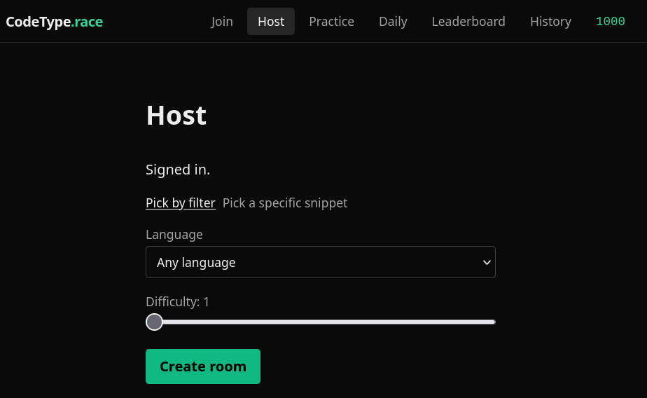
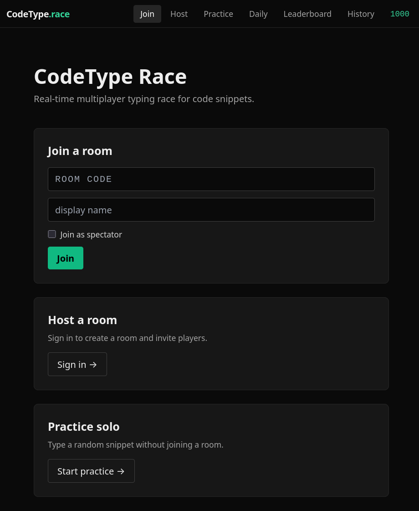
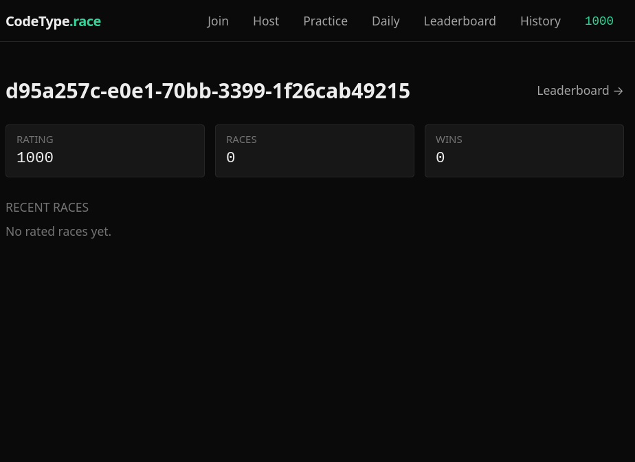
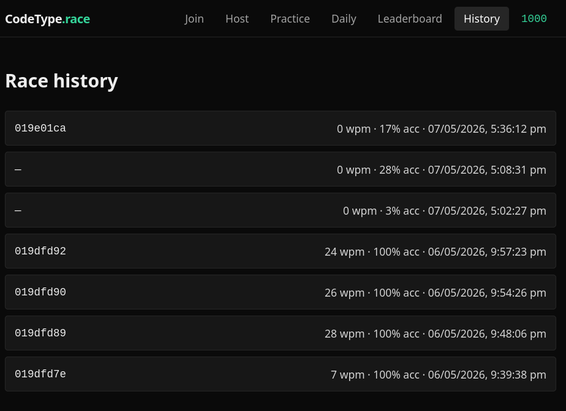
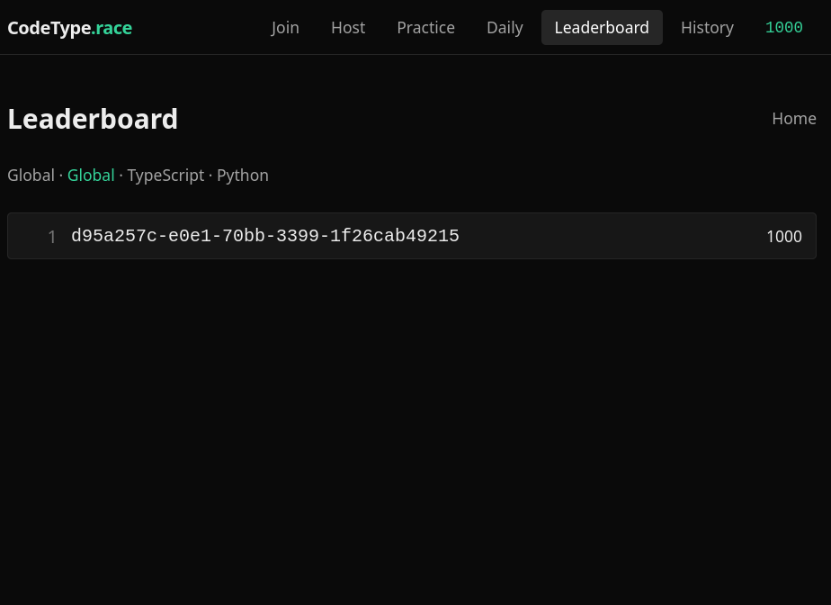
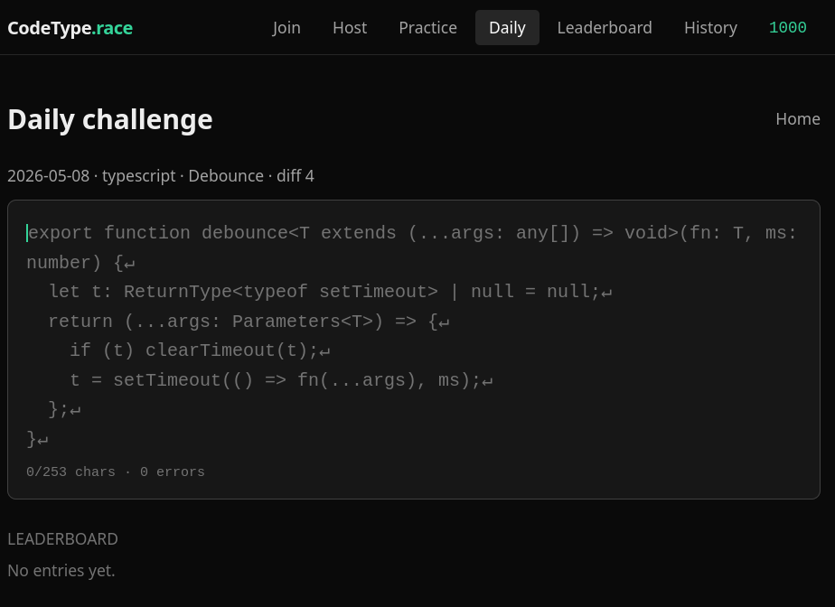
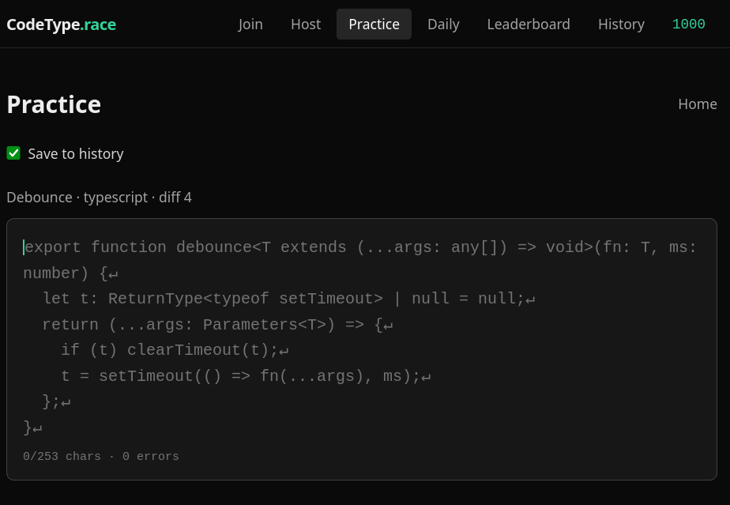
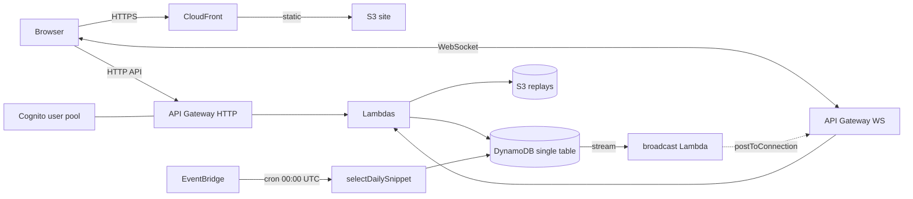

# codetype-race

Real-time multiplayer typing race for code snippets. A host creates a room, shares a 6-character join code, 2–8 players join a lobby, everyone races the same snippet at the same time, and a podium shows the winner with WPM and accuracy.

Live at **https://race.codephase.dev**.

## Overview

### Problem
- **Who is affected?** Programming students at 42 Singapore (and similar peer-learning environments) who want low-stakes, high-frequency reps on real code — not English prose typing tests like Monkeytype, and not solo drills.
- **What is the issue?** Existing typing trainers measure prose WPM, which has weak transfer to writing code. Group practice is ad-hoc (screen-share + stopwatch) and there's no shared, fair leaderboard for "who can hammer out a `useEffect` cleanly under pressure". A multi-user race over identical snippets makes the practice social, comparable, and repeatable.

### Outcome
- A working fullstack prototype: 2–8 concurrent players per room, real-time cursor broadcast over WebSockets, podium with WPM/accuracy, Elo-rated global and per-language leaderboards.
- Feature surface delivered across 7 phases (see `docs/specs/`): workspaces + XState frontend, Zod-validated backend, spectator/practice/rematch, profiles + Elo, race chat, daily challenge, replays, community snippet uploads, anti-cheat heuristics, CI + CloudWatch monitoring.
- **Measurable shape of the system:**
  - Single-region serverless deployment (ap-southeast-1) — no idle cost when nobody is racing.
  - Single DynamoDB table + 1 GSI; all access through a `repos/*` layer.
  - Cursor flush coalesced to **20 Hz** (one `CURSOR_FLUSH` per 50 ms) to keep WS write costs bounded.
  - CI gate: 4 parallel test jobs (`shared`, `lambdas`, `web`, `infra`) + a `merge-gate` job, all required.
  - E2E: Playwright scaffold against `bun dev`.

---

## Demo

User flow, end to end — screenshots from each surface live in `assets/`:

### 1. Host creates a room

The host picks a snippet (filter by language/difficulty), and the app generates a 6-character join code to share.

### 2. Players join with the code

Anyone with the code lands in the same lobby. 2–8 players per room.

### 3. Race + podium
The host starts a 3-second countdown; everyone types the same snippet with live cursor lanes. On finish, the server validates each run (anti-cheat heuristics), computes WPM/accuracy, and applies an Elo delta when ≥2 rated players raced.

### 4. Profile + race history
 
Every race is appended to your profile with WPM, accuracy, and Elo delta over time.

### 5. Leaderboards

Global and per-language leaderboards. Rating rows are swapped in a single `TransactWriteItems` together with the profile and race-history writes, so the leaderboard never diverges from the underlying ratings.

### 6. Daily challenge

EventBridge fires at 00:00 UTC; a `selectDailySnippet` Lambda picks the day's snippet. Each user gets one ranked attempt per day.

### 7. Practice (solo)

No account needed — useful for warm-ups and snippet discovery without affecting your rating.

---

## Technology Stack

### Frontend components
- **Next.js 16** (App Router) compiled to a **static export** → S3 + CloudFront. No server-side rendering at runtime; all dynamic data comes from the HTTP and WebSocket APIs.
- **React 18** + **TypeScript 5.6**.
- **XState v5** + `@xstate/react` for the room state machine (`idle → connecting → lobby → countdown → racing → finished`, plus `reconnecting`/`error`). Three child actors: `wsActor`, `countdownActor`, `cursorThrottleActor`.
- **Tailwind CSS 3.4** for styling.
- **AWS Amplify Auth (Cognito)** for sign-in / token management on the client.
- **Playwright** for end-to-end tests.

### Backend components
- **AWS Lambda** (Node.js 20, esbuild-bundled via `aws-cdk-lib/aws-lambda-nodejs`) — handlers under `lambdas/src/{http,ws,stream,cron}/`. Each handler is wrapped with `withHttp` / `withWs` / `withWsLifecycle` / `withStream` middleware that owns input parsing, Zod validation, structured logging, and error envelope shaping.
- **API Gateway HTTP API** for REST endpoints (rooms, profiles, snippets, replays, leaderboards).
- **API Gateway WebSocket API** for in-race messages (`cursor`, `start`, `finish`, `chat`, `heartbeat`).
- **DynamoDB** — single table + 1 GSI; all access through `lambdas/src/repos/*`. Key conventions in `shared/src/ddb-keys.ts`.
- **DynamoDB Streams → broadcast Lambda** that fans out player updates via `postToConnection` to all WS connections in a room.
- **S3** — two buckets: static site assets (behind CloudFront) and race replay JSON.
- **Cognito User Pool** for identity; JWT claims (`sub`, `cognito:groups`) read by `withHttp`.
- **EventBridge** cron (`00:00 UTC`) → `selectDailySnippet` Lambda picks the day's challenge.
- **CloudWatch** dashboards + alarms (EMF metrics emitted by middleware) — see `infra/lib/monitoring-stack.ts` and `docs/specs/08-polish-and-ci.md`.
- **Validation:** Zod schemas in `@codetype/shared/schemas`, shared by lambdas and web.
- **CDK** (`aws-cdk-lib` 2.158) — two stacks: `CodetypeStack` and `CodetypeMonitoringStack`.

---

## Development Approach with AI

This project was built primarily with AI as a co-developer, using a **spec-first, phase-as-PR** workflow. Each phase in `docs/specs/` corresponds to one merged feature branch in `git log`.

### AI tools, services, and models used
| Tool / Model | Purpose |
|---|---|
| **Claude Code (Claude Opus 4.x)** | Primary IDE-integrated agent. Used for spec authoring, multi-file refactors (Phase 02 workspace migration, Phase 03 middleware/repos, Phase 04 XState refactor), and test scaffolding. |
| **Claude.ai chat (web)** | Architecture brainstorming before each phase — trade-offs (e.g. WS vs SSE, single-table vs multi-table DDB, S3 vs DDB for replays). |
| **GitHub Copilot** | In-editor line completion for boilerplate (Zod schema fields, repo CRUD methods, test fixtures). |
| **Mermaid via Claude** | All architecture diagrams in `docs/architecture.md` and `README.md`. |

### AI agents and their roles
This repo uses Claude Code's Skill system (see the `.claude/` plugins active in this workspace). Agents/skills used during development:
- **`feature-dev:code-architect`** — designed the phase plans in `docs/specs/` from the original `01codetype-race-plan.md` brief.
- **`feature-dev:code-explorer`** — mapped the existing repo before each refactor (Phase 03/04) so the agent could change call-sites consistently.
- **`feature-dev:code-reviewer`** — reviewed each phase's diff for missed call-sites, type drift, and dead code.
- **`superpowers:test-driven-development`** — enforced "write the test first" for `shared/src/elo.ts`, `shared/src/anticheat.ts`, and the room machine.
- **`superpowers:systematic-debugging`** — used when the CDK synth broke (commits `343e13c`, `e412b79`).
- **`superpowers:verification-before-completion`** — gate before claiming a phase done; ran `bun --filter '*' test` + `bun run cdk synth` before the commit.

### Key prompts used

1. **Spec generation (Phase 02 onward):**
   *"Read `docs/01codetype-race-plan.md` and split the remaining work into independently-mergeable phases. Each phase becomes one file under `docs/specs/`. For each phase, produce: scope, target signatures, acceptance criteria (PR merge checklist), and a minimum test list."*
2. **Backend refactor (Phase 03):**
   *"Move every `dynamodb-client` call out of handlers into `lambdas/src/repos/*`. Wrap every handler with `withHttp` / `withWs` middleware that owns Zod validation, structured logging, and an `AppError` → HTTP-status mapper. Don't change behaviour; tests must still pass."*
3. **Frontend FSM (Phase 04):**
   *"Rewrite `RoomClient.tsx` as an XState v5 machine. The machine owns the WebSocket lifecycle, countdown, and cursor throttle as child actors. The component becomes a thin view that sends events and reads `state.context`."*
4. **Anti-cheat (Phase 07-A):**
   *"Implement heuristics in `shared/src/anticheat.ts` that flag — never auto-ban — runs that are statistically implausible (sub-human keypress intervals, perfect accuracy at >200 WPM, paste-shaped progress curves). Tests first."*
5. **CI (Phase 08):**
   *"Write `.github/workflows/ci.yml`: four parallel jobs by package, plus a `merge-gate` job that depends on all four. Cache Bun + node\_modules. Don't run E2E in CI yet — just typecheck, lint, unit tests, and `cdk synth`."*

### Key review points and decisions
| Review point | Decision | Rationale |
|---|---|---|
| Bun workspaces vs single package | **Adopted workspaces** in Phase 02 (reversing original "no workspaces" stance). | Sharing `@codetype/shared` between `lambdas` and `web` without a publish step was the dominant cost. |
| Replays in DynamoDB vs S3 | **S3 only.** | Replay payloads can hit hundreds of KB; DDB item-size cap and write costs make S3 strictly cheaper. |
| WebSocket vs Server-Sent Events for race broadcast | **WebSocket.** | Bidirectional `cursor` + `chat` + `heartbeat` from each client; SSE would have needed a second HTTP path. |
| Anti-cheat: auto-ban vs flag | **Flag, never auto-ban.** | Heuristics will false-positive on fast typists. Flagged runs are stored but excluded from rating updates. |
| Cursor message rate | **Throttle to 20 Hz** in a `cursorThrottleActor`. | At 60 Hz × 8 players × hundreds of rooms, WS message cost dominates. 20 Hz is visually indistinguishable. |
| State management on the web | **XState v5** over Redux/Zustand. | The room flow is a true FSM with reconnect/error transitions; modeling it as effects in `useEffect` had already produced reconnect bugs. |
| Idempotency for Elo writes | **`elo_applied` flag on the room META item + `TransactWriteItems`.** | Stream-driven retries must not double-apply rating deltas. |

---

## Installation

### Prerequisites
| Tool | Version | Notes |
|---|---|---|
| **Bun** | ≥ 1.1 | Used for the workspace install, scripts, and `bun test`. |
| **Node.js** | ≥ 20 | Lambda runtime target; some CDK toolchains shell out to Node. |
| **AWS CLI v2** | latest | Authenticated profile required for `cdk deploy`. |
| **AWS CDK** | 2.158 | Pulled in via the `infra` workspace; `bunx cdk` works without a global install. |
| **Region** | `ap-southeast-1` | Default; override with `--region` on CDK commands and `NEXT_PUBLIC_COGNITO_REGION`. |
| **Bootstrapping** | one-time per account/region | `bunx cdk bootstrap aws://<account-id>/ap-southeast-1`. |

### Setup
```bash
# 1. Clone and install all workspace deps from the repo root
git clone <this-repo>
cd codetype-race
bun install

# 2. (one-time per AWS account+region) bootstrap CDK
bunx cdk bootstrap --profile your_profile

# 3. Deploy the certificate stack (us-east-1, required by CloudFront), then the app + monitoring stacks
bun run cdk deploy CodetypeCertificateStack --profile your_profile
bun run cdk deploy CodetypeStack --profile your_profile
ALARM_EMAIL=you@example.com bun run cdk deploy CodetypeMonitoringStack --profile your_profile

# The CodetypeStack provisions race.codephase.dev (CloudFront alias + Route53 ARecord/AAAARecord
# in the codephase.dev hosted zone). Override SITE_DOMAIN/HOSTED_ZONE in infra/bin/app.ts if forking.

# 4. Seed the snippet table
AWS_PROFILE=your_profile TABLE_NAME=codetype bun scripts/seed-snippets.ts

# 5. Wire up the web app
cp web/.env.local.example web/.env.local   # then fill from CDK outputs (table below)

# 6. Run locally
bun --filter @codetype/web dev    # http://localhost:3000
```

### Environment variables

#### Web (`web/.env.local`)
| Var | Source |
|---|---|
| `NEXT_PUBLIC_HTTP_API` | CDK output `HttpApiUrl` |
| `NEXT_PUBLIC_WS_API` | CDK output `WsApiUrl` |
| `NEXT_PUBLIC_COGNITO_USER_POOL_ID` | CDK output `UserPoolId` |
| `NEXT_PUBLIC_COGNITO_USER_POOL_CLIENT_ID` | CDK output `UserPoolClientId` |
| `NEXT_PUBLIC_COGNITO_REGION` | e.g. `ap-southeast-1` |

#### Monitoring stack
| Var | Effect |
|---|---|
| `ALARM_EMAIL` | Subscribes the SNS alarm topic to this address. AWS sends a confirmation email on first deploy. |

---

## Usage

### As an end-user (player)
1. Open https://race.codephase.dev (or the CloudFront URL from CDK output `SiteUrl`).
2. **Sign in** (Cognito email/password) — or use **Practice** without an account.
3. **Host a race:** *Create Room* → pick a snippet (filter by language/difficulty) → copy the 6-char code.
4. **Join a race:** paste the code on the home page.
5. In the lobby, the host clicks **Start**. A 3-second countdown begins for everyone.
6. Type the snippet. Your cursor lane shows your live progress; opponents' lanes show theirs.
7. On finish, the **podium** shows ranked WPM/accuracy and Elo deltas; click **Rematch** to recycle the lobby with the same players.
8. **Daily challenge** — a single shared snippet refreshes at 00:00 UTC; one ranked attempt per user per day.
9. **Replay** — every race produces a replay you can scrub from your profile.

### As a developer
```bash
# Tests
bun --filter '*' test                       # all packages
bun --filter @codetype/shared test
bun --filter @codetype/lambdas test
bun --filter @codetype/web test

# Web dev / build
bun --filter @codetype/web dev
bun --filter @codetype/web build

# CDK
bun run cdk synth
bun run cdk deploy CodetypeStack --profile your_profile
bun run cdk deploy CodetypeMonitoringStack --profile your_profile

# Seed snippets after first deploy
AWS_PROFILE=your_profile TABLE_NAME=codetype bun scripts/seed-snippets.ts

# End-to-end (Playwright; runs against `bun dev` by default)
bun --filter @codetype/web exec playwright install   # one-time
bun --filter @codetype/web e2e
```

---

## Project Structure

This repo is a **Bun workspaces monorepo**. The B1 rubric suggests a flat `src/` + `tests/` layout — that convention assumes a single-package project. We deviate because four artifacts (pure-TS shared lib, Lambda handlers, Next.js app, CDK app) each need their own `tsconfig`, `package.json`, and test runner config. Tests are colocated per workspace under `<workspace>/src/**/*.test.ts` and run via `bun --filter <name> test`; there is no top-level `tests/` directory by design.

```
codetype-race/
├── README.md                  # this file
├── LICENSE                    # Apache 2.0
├── .gitignore
├── package.json               # root workspace declaration + cross-cutting scripts
├── bun.lock
├── cdk.json                   # CDK app entry: infra/bin/codetype.ts
│
├── shared/      @codetype/shared   # pure TS: wpm, streak, ddb-keys, schemas, elo, anticheat
│   └── src/
│       ├── *.ts
│       └── *.test.ts          # bun test, colocated
│
├── lambdas/     @codetype/lambdas  # AWS Lambda handlers
│   └── src/
│       ├── http/              # REST handlers
│       ├── ws/                # WebSocket action handlers
│       ├── stream/            # DDB-stream broadcast Lambda
│       ├── cron/              # daily-snippet picker
│       ├── repos/             # the only place that talks to DynamoDB
│       └── middleware/        # withHttp / withWs / withStream
│
├── infra/       @codetype/infra    # AWS CDK app
│   ├── bin/codetype.ts        # entry — instantiates both stacks
│   └── lib/
│       ├── codetype-stack.ts
│       └── monitoring-stack.ts
│
├── web/         @codetype/web      # Next.js 16 app (static export → S3 + CloudFront)
│   ├── src/
│   │   ├── app/               # App Router routes
│   │   ├── components/
│   │   └── lib/machines/      # XState machines (roomMachine, etc.)
│   └── tests/ + *.test.ts     # unit (bun test) + Playwright e2e
│
├── data/                      # Seed snippet JSON (canonical)
├── scripts/                   # Bun scripts (seed-snippets, loc.sh)
├── assets/                    # Screenshots/GIFs for the Demo section (populate before submission)
├── docs/
│   ├── architecture.md        # layers, request flows, storage shapes
│   ├── 01codetype-race-plan.md # original brief
│   ├── B1-Builders-Programme.md
│   └── specs/                 # phase-as-PR specs (00-overview indexes them)
└── .github/workflows/ci.yml   # 4 parallel jobs + merge-gate
```

### Architecture (one-liner per layer)


Deeper diagrams (HTTP request flow, WS message flow, room FSM, DDB key shapes) live in `docs/architecture.md`.

---

## CI

`.github/workflows/ci.yml` runs four parallel jobs (`shared`, `lambdas`, `web`, `infra`) plus a `merge-gate` job that requires all four. PR-preview stacks and Lighthouse CI are deferred — see `docs/specs/08-polish-and-ci.md`.

---

## Reflection

The biggest lesson from this project was that **the way you talk to the AI matters more than which model you use**. I started out treating Claude like a faster Stack Overflow — pasting in errors, asking for fixes, copying back. The output worked, but I couldn't explain *why* it worked, and a week later I couldn't extend it without breaking it. The project only really began moving once I switched to a spec-first workflow: write down what I wanted in `docs/specs/0X-*.md` first, get the agent to argue with me about it, *then* let it touch code. The phases in `git log` are basically a record of me learning that lesson in public.

### What worked
- **Spec-first phases.** Once each phase had a written spec — scope, target signatures, acceptance criteria, test list — the agent stopped wandering. The spec became the merge checklist, which meant I always knew when a phase was actually done versus when it just *felt* done. PRs got smaller and reviewable as a side effect.
- **Sharing real code between client and server.** Pulling WPM math, Elo math, Zod schemas, and DDB key builders into `@codetype/shared` was the single highest-leverage decision. The same schema validates an HTTP request on the server and a form on the client, so I literally cannot ship a shape mismatch between them.
- **Middleware + repos refactor (Phase 03).** Forcing every Lambda through `withHttp`/`withWs` and every DDB call through `repos/*` killed an entire category of "I forgot to validate / I forgot to log / I forgot to wrap the error" bugs. After this phase, new handlers became boring to write — which is exactly what I wanted.
- **XState for the room flow (Phase 04).** I had been modelling the room as a pile of `useEffect`s and `useState`s; reconnect bugs were constant. Drawing the FSM on paper, then translating it to XState, made several latent bugs disappear *before* I even ran the tests because the impossible transitions became unrepresentable.
- **Treating the agent like a junior pair, not an oracle.** Asking "what are three options here, and what would each cost?" produced way better outcomes than "do X." The Elo idempotency design and the S3-vs-DDB replay decision both came out of that style of conversation.

### What failed (initially)
- **First Lambda bundling attempt.** I had Claude build a custom esbuild + CDK asset pipeline before discovering `aws-cdk-lib/aws-lambda-nodejs` already does it. Around 80 lines of bundling code got deleted in the cleanup. Lesson: ask "is there an idiomatic CDK construct for this?" *before* writing one yourself.
- **Original "no workspaces" stance.** I started this project explicitly avoiding monorepos because I'd been burned by them before. After the third time I duplicated a type between `web/` and `lambdas/`, I reversed the decision in Phase 02. Sometimes the right call is to admit the original constraint was wrong.
- **CI infra job took three tries.** The `bun --filter @codetype/infra run cdk synth` invocation kept inserting a stray `run` keyword that broke the synth (commits `343e13c`, `e412b79`). I should have run the exact CI command locally first instead of trusting the agent's version of "this will work in CI."
- **Blindly trusting agent-generated tests.** Early tests asserted what the code *did*, not what the spec *required*. A few of them re-passed even when I broke the underlying behaviour. After that I made the agent write tests from the spec acceptance criteria, not from the implementation.

### Changes made and rationale
- **Replays moved from DynamoDB to S3** once a single replay file crossed ~120 KB. Cheaper, no item-size cliff, and replays are append-only blobs anyway — DDB was the wrong tool.
- **Cursor throttle moved into a child XState actor**, not a `setTimeout` inside the React component. The component-level version leaked timers on remount during reconnects.
- **Anti-cheat changed from auto-ban to flag-only** after a synthetic test false-positived on a 140 WPM run. Heuristics will *always* false-positive on fast typists; the only safe policy is to flag and let a human decide.
- **Idempotency for Elo writes** done with an `elo_applied` flag on the room META item, applied inside the same `TransactWriteItems` that updates each profile, swaps each leaderboard row, and appends race history. Stream-driven retries cannot double-apply rating deltas.

### What I'd do differently next time
- **Write Playwright E2E in Phase 02, not Phase 08.** Some Phase 06 chat regressions would have been caught a phase earlier. Unit tests don't cover the WS reconnect path.
- **Stand up CloudWatch dashboards in Phase 03.** I was diagnosing "feels laggy" by squinting at logs for two phases when a p95-latency widget would have shown me the WS broadcast hot loop in five seconds.
- **Keep a `prompts.md` log per phase.** I can reconstruct the prompts I used — but next time I'd save them as I go. Future-me reviewing this repo (or a grader assessing my workflow) shouldn't have to reverse-engineer them from the diff.

### How I'd characterise the AI's contribution vs mine
The AI wrote most of the *typing* — handlers, repos, schemas, tests, CDK boilerplate. I owned every architectural decision (workspaces, XState, single-table DDB, S3 replays, flag-don't-ban anti-cheat) and every "this still feels wrong, try again" moment. The output is genuinely a collaboration: the agent is faster and more thorough at the mechanical parts; I'm the one who knows when something is done.

---

## Specs

The phased roadmap lives in [`docs/specs/`](./docs/specs/). Each spec is a phase-as-PR; the order is captured in `00-overview.md`.
