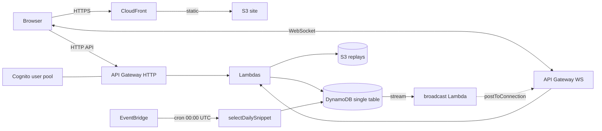

# codetype-race

Real-time multiplayer typing race for code snippets. A host creates a room, shares a 6-character join code, 2–8 players join a lobby, everyone races the same snippet at the same time, and a podium shows the winner with WPM/accuracy.

See `docs/specs/00-overview.md` for the active per-phase roadmap and `docs/architecture.md` for the system shape.

## Repo layout

Bun workspaces: a single root `package.json` declares four packages, all linked at `node_modules/@codetype/*`.

```
shared/    @codetype/shared — pure TS: wpm, streak, ddb-keys, schemas, elo, anticheat
lambdas/   @codetype/lambdas — AWS Lambda handlers (http/, ws/, stream/, cron/)
infra/     @codetype/infra — AWS CDK app (Codetype + monitoring stacks)
web/       @codetype/web — Next.js 16 app (static export → S3 + CloudFront)
data/      Seed snippet JSON (canonical)
scripts/   Bun scripts (e.g. seed-snippets)
```

## Architecture



## Local dev

```bash
# Install all workspace deps from the repo root
bun install

# Tests
bun --filter '*' test          # all packages
bun --filter @codetype/shared test
bun --filter @codetype/lambdas test
bun --filter @codetype/web test

# Web dev server
bun --filter @codetype/web dev

# Web production build
bun --filter @codetype/web build

# CDK synth / deploy
bun --filter @codetype/infra exec cdk synth
bun --filter @codetype/infra exec cdk deploy CodetypeStack --profile your_profile
bun --filter @codetype/infra exec cdk deploy CodetypeMonitoringStack --profile your_profile

# Seed snippets after first deploy
AWS_PROFILE=your_profile TABLE_NAME=codetype bun scripts/seed-snippets.ts

# End-to-end (Playwright; runs against `bun dev` by default)
bun --filter @codetype/web exec playwright install   # one-time
bun --filter @codetype/web e2e
```

## Environment variables

### Web (`web/.env.local`)

| Var | Source |
|---|---|
| `NEXT_PUBLIC_HTTP_API` | CDK output `HttpApiUrl` |
| `NEXT_PUBLIC_WS_API` | CDK output `WsApiUrl` |
| `NEXT_PUBLIC_COGNITO_USER_POOL_ID` | CDK output `UserPoolId` |
| `NEXT_PUBLIC_COGNITO_USER_POOL_CLIENT_ID` | CDK output `UserPoolClientId` |
| `NEXT_PUBLIC_COGNITO_REGION` | e.g. `ap-southeast-1` |

### Monitoring stack

| Var | Effect |
|---|---|
| `ALARM_EMAIL` | Subscribes the SNS alarm topic to this address. AWS sends a confirmation email on first deploy. |

## CI

`.github/workflows/ci.yml` runs four parallel jobs (`shared`, `lambdas`, `web`, `infra`) plus a `merge-gate` job that requires all four. PR-preview stacks and Lighthouse CI are deferred — see `docs/specs/08-polish-and-ci.md`.

## Specs

The roadmap lives in [`docs/specs/`](./docs/specs/). Each spec is a phase-as-PR; the order is captured in `00-overview.md`.
