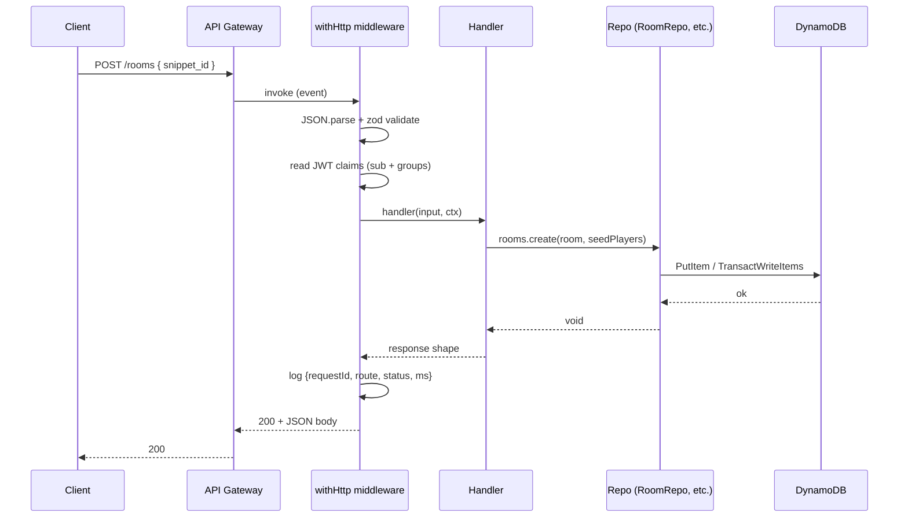
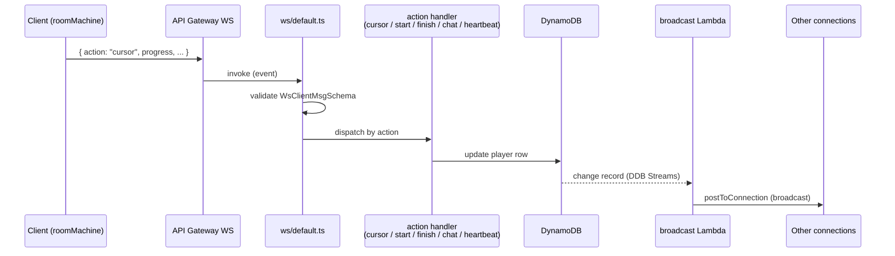

# Architecture

## Layers

- **`@codetype/shared`** — pure TypeScript. Zod schemas, DDB-key builders, WPM math, Elo math, anti-cheat heuristics, type re-exports. No SDK imports. Used by both `lambdas` and `web`.
- **`@codetype/lambdas`** — AWS Lambda handlers. Each handler is wrapped with `withHttp` / `withWs` / `withWsLifecycle` / `withStream` middleware that owns input parsing, schema validation, structured logging, and error envelope shaping. Handlers contain only business logic; all DynamoDB access goes through `lambdas/src/repos/*`.
- **`@codetype/infra`** — CDK app with two stacks: `CodetypeStack` (the application) and `CodetypeMonitoringStack` (dashboards + alarms).
- **`@codetype/web`** — Next.js 16 static-export app. The room flow is driven by an XState v5 machine (`roomMachine`) with three actors: `wsActor`, `countdownActor`, `cursorThrottleActor`. Practice and daily flows have their own smaller machines.

## HTTP request flow



A failure inside the handler throws an `AppError`; the middleware maps `error.status` onto the HTTP code and serializes `{error: {code, message, details?}}`. Zod errors map to `BAD_REQUEST` with the flattened issues as `details`.

## WebSocket message flow



`ws/finish.ts` additionally:

1. Computes WPM/accuracy.
2. Runs `evaluateStats` (anti-cheat) — flagged runs are stored but excluded from rating updates.
3. If every racer has finished and ≥2 are rated, computes Elo deltas and applies a single TransactWrite that updates each profile, swaps each user's leaderboard rows, appends race history, and sets `elo_applied` on the room (idempotency).
4. Broadcasts a `ratings` WS message to every connection.

## Room state machine

See `web/src/lib/machines/roomMachine.ts`. State chart from the Phase 04 spec:

```
idle → connecting → lobby
                 ↘ countdown (if status == countdown/running on connect)
lobby → countdown (on status WS msg) → racing → finished
        ↘ reconnecting (on WS_CLOSE) → connecting (after backoff) | error
```

Side effects live in three actors:

- `wsActor` — opens the WebSocket, sends heartbeats, dispatches `WS_OPEN/CLOSE/ERROR/MSG` events into the parent. Receives `SEND_*` events from the parent and writes them to the socket.
- `countdownActor` — emits `TICK` (seconds remaining) and `COUNTDOWN_DONE` off wall clock.
- `cursorThrottleActor` — coalesces TYPED events into one `CURSOR_FLUSH` per 50ms (20Hz).

## Storage shapes

Single DynamoDB table, single GSI. Conventions captured in `shared/src/ddb-keys.ts`:

| Item | PK | SK |
|---|---|---|
| Room META | `ROOM#<id>` | `META` |
| Room player | `ROOM#<id>` | `PLAYER#<name>` |
| Room result | `ROOM#<id>` | `RESULT#<finishedAt>#<name>` |
| Connection | `ROOM#<id>` | `CONN#<connectionId>` |
| Snippet | `SNIPPET#<id>` | `META` |
| User profile | `USER#<sub>` | `PROFILE` |
| User race | `USER#<sub>` | `RACE#<finishedAt>#<roomId>` |
| User practice run | `USER#<sub>` | `PRACTICE#<finishedAt>` |
| User daily counter | `USER#<sub>` | `SUBMIT_DAY#<YYYY-MM-DD>` |
| Global leaderboard row | `LEADERBOARD#GLOBAL` | `RATING#<paddedInverse>#<sub>` |
| Per-language leaderboard | `LEADERBOARD#LANG#<lang>` | `RATING#<paddedInverse>#<sub>` |
| Daily META | `DAILY#<YYYY-MM-DD>` | `META` |
| Daily user pointer | `DAILY#<YYYY-MM-DD>` | `USER#<sub>` |
| Daily leaderboard row | `DAILY#<YYYY-MM-DD>` | `RUN#<paddedInverseWpm>#<sub>` |
| Pending snippet queue | `QUEUE#SNIPPETS#PENDING` | `SUBMITTED#<ts>#<id>` |

GSI1 is reused with multiple `GSI1PK` namespaces:

- `CODE#<code>` → `ROOM#<id>` for room lookup by join code.
- `LANG#<lang>` → `DIFF#<n>#SNIPPET#<id>` for snippet filter queries (random + list).
- `CONN#<connectionId>` → `ROOM#<id>` for resolving a connection back to its room.
- `HOST#<sub>` → `FINISHED#<ts>` for the host's history listing.

Replays live in S3 at `replays/<roomId>.json` with a 90-day lifecycle expiration.

## Observability

Every request emits a one-line JSON log: `{requestId, route, status, ms, code?, err?}`. CloudWatch picks up Embedded Metric Format lines from `lambdas/src/metrics.ts` (`Codetype` namespace): `RaceFinished`, `RaceDurationMs`, `AntiCheatFlag` (dimensioned by `signal`), `ChatRateLimited`, `WsReconnect`. The `CodetypeMonitoringStack` renders these on a dashboard and wires error-rate / throttle alarms to an SNS topic. Subscribe an email to the topic by setting `ALARM_EMAIL` before the first deploy.
